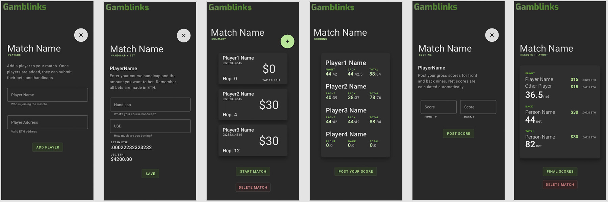

# Gamblinks

## A dApp for golfers who like to bet

The original intent of this project was to find real world uses for web3 products. Wagering in real life circumstances seemed like a good fit. In this case, we are using a dApp to allow golfers to bet amongst themselves. By using crypto, players do not have to carry cash, they can bet different amounts, and handling payouts is done automatically when the round ends.

The contracts here are not intended to be used on mainnet. They gas consumption is outrageous. This was an initial attempt to understand how web3 will impact user experience, and discover what it might be like using the blockchain in everyday applications. Perhaps, if deployed on Polygon, or another scaling chain, the fees would be manageable.

## Features

- Golfers escrow funds into a contract prior to the start of a match
- Golfers can bet different amounts, but can only win as much as they  bet
- Scores are reported through the dApp, and payouts are calculated automatically
- Once you enter a match, you are commited, there is no backing out

## Tech

Technologies involved:
- [Solidity] - This contract uses factory pattern to create a new contract for each match created. Each match has a "coordinator," a person designated to put a match together.
- [React] - The frontend for this dApp was created with React
- [Chainlink] - A Chainlink price feed is used for USD conversion. Bets are made in USD, then converted to ETH on submission.
